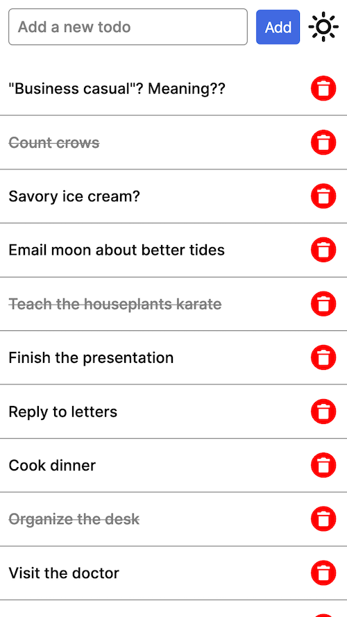
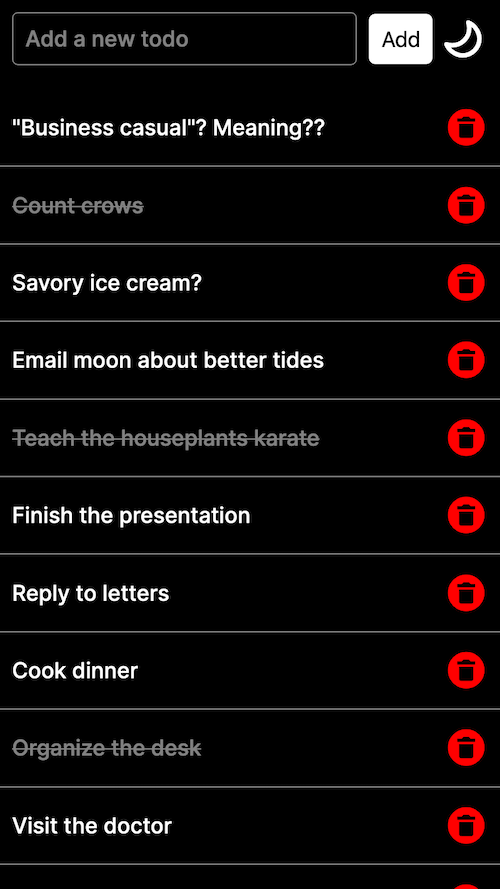

# Donezo

<a href="https://tecnate.dev" target="_blank" rel="author">Tecnate</a> | Last Updated: 31 Dec 2024

<!-- TABLE OF CONTENTS -->

  
Table of Contents

  <ol>
    <li>
      <a href="#about-the-project">About The Project</a>
      <ul>
        <li><a href="#built-with">Built With</a></li>
      </ul>
    </li>
    <li>
      <a href="#getting-started">Getting Started</a>
      <ul>
        <li><a href="#prerequisites">Prerequisites</a></li>
        <li><a href="#installation">Installation</a></li>
      </ul>
    </li>
    <li><a href="#usage">Usage</a></li>
    <li><a href="#roadmap">Roadmap</a></li>
    <li><a href="#contributing">Contributing</a></li>
    <li><a href="#license">License</a></li>
    <li><a href="#contact">Contact</a></li>
    <li><a href="#acknowledgments">Acknowledgments</a></li>
  </ol>

<!-- ABOUT THE PROJECT -->

## About The Project

**About The Project**

I created this To Do mobile app to deepen my understanding of React Native and Expo. This project explores core concepts like CRUD operations, dynamic navigation, and advanced UI features.

Key features include:

-   **CRUD Functionality**: Demonstration of seamless state management and interactivity.
-   **Navigation with Expo Router**: Implementation of a dynamic file-based routing system for intuitive screen transitions and navigation.
-   **List Views**: Rendering of list items effectively.
-   **Data Storage**: Utilization of local storage to persist tasks, ensuring data is retained even after closing the app.
-   **Theme Toggling**: Addition of light and dark mode themes for a customizable user experience.
-   **Animations**: Integration of animations to polish the user interface.
-   **Custom Fonts**: Importation of new fonts.

### Built With

This is a project built with React Native and the Expo framework that implements:

-   Expo
    -   Router, Status Bar, Stack
-   React
    -   useState, useContext, useEffect
-   React Native
    -   View, Text, StyleSheet, Pressable, TextInput, SafeAreaProvider, Async Storage
-   Light/Dark themes
-   Custom icons and fonts

<!-- GETTING STARTED -->

## Getting Started

This app is designed for mobile devices or viewport sizes. See the Usage section below.

### Prerequisites

Prior knowledge of:

-   JavaScript, TypeScript, & React
-   Node.js
-   Terminal

### Installation

You will need:

-   Expo Go installed on a physical device
-   Node.js
-   A code editor
-   A macOS, Linux, or Windows (PowerShell and WSL2) terminal

To initialize a blank project from the terminal:

1. Install the latest Expo: `npx create-expo-app@latest`
2. Name your project and accept any prompts to continue.
3. Move into the root directory: `cd myNewApp`
4. Reset your project (moves the example files to a new directory): `npm run reset-project`.
5. Delete the above directory containing the example files: `rm -rf app-example`
6. If you plan to use only JavaScript rather than typescript, add the following to your **tsconfig.json** file's `include` object: `"**/*.jsx",`

<!-- USAGE EXAMPLES -->

## Usage

### Get Things Running

In the terminal, run `npx expo start` to start Expo (or `npx expo start -c` to start and clear the cache).

-   Type `w` when prompted to see your project render in a web browser.
-   Use your mobile device's camera to scan the QR code that generates in the terminal to see your project render on your mobile screen.

### Troubleshooting

If you encounter errors trying to start Expo on your mobile device or web browser:

1. Delete your **node_modules** directory: `rm -rf node_modules`
2. Reinstall your **node_modules** directory: `npm install`

### Interactions

-   Press on items to edit.
-   Long press on items to strike through.
-   Press the trash icon to delete.
-   Press the sun/moon icon to toggle light/dark themes.

<!-- ROADMAP -->

## Roadmap

TBD

<!-- CONTRIBUTING -->

## Contributing

This project is for learning/demonstration and is not being actively developed.

<!-- LICENSE -->

## License

Distributed under the [MIT License](https://choosealicense.com/licenses/mit/).

<!-- CONTACT -->

## Contact

Nate: [Website](https://tecnate.dev/) | [GitHub](https://github.com/nvsmith) | [Gravatar Profile](https://gravatar.com/nvsmith435)

<!-- ACKNOWLEDGMENTS -->

## Acknowledgments

#### Dave Gray

-   [React Native for Beginners](https://youtube.com/playlist?list=PL0Zuz27SZ-6OH3xackTS2KLcnmxx5wW7c&si=Hyvi2omsg2536uvf)

#### README Template

-   [Best README Template](https://github.com/othneildrew/Best-README-Template/tree/master)

(<a href="#readme-top">back to top</a>)

